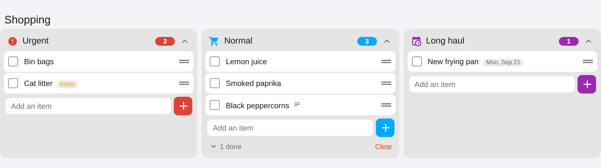
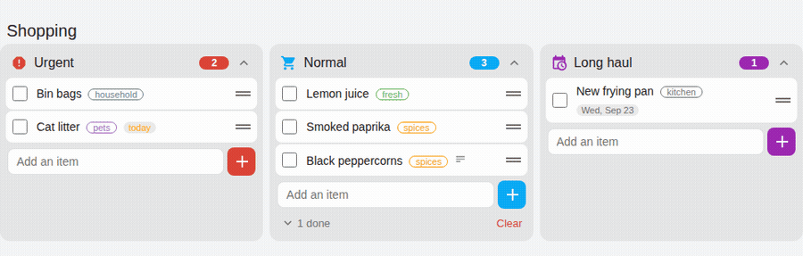
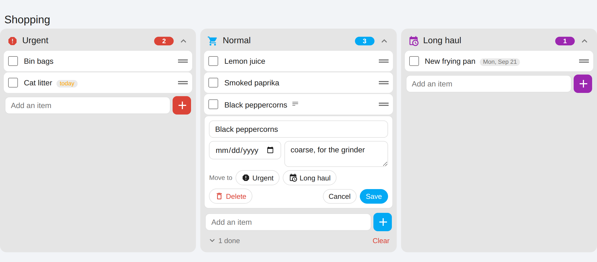
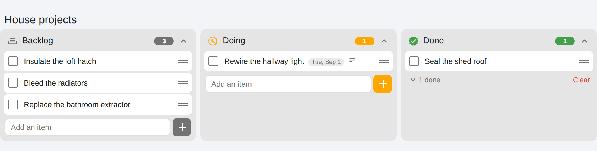
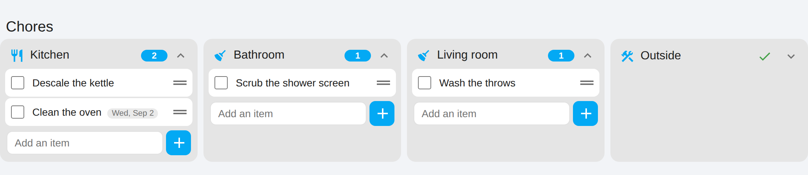
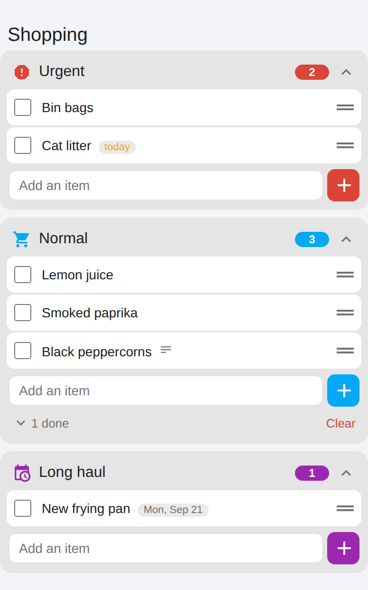
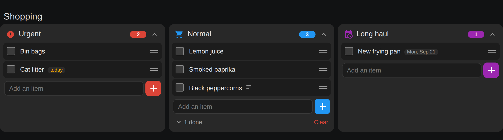

# Todo Kanban Card

A kanban board over Home Assistant's `todo` entities. Several lists side by side, and
**you can drag an item from one list to another** — which is the part Home Assistant
cannot do on its own.

There is no service for moving a todo item between lists, and the built-in todo-list
card has no control for it. So an item that landed on the wrong list stays there, or
gets deleted and retyped. This card fixes that, and arranges any number of lists as
lanes while it is at it.



**Moving an item between lists is the whole point.** Drag by the handle on the right of
a row — to another position, or to another lane:



## What it does

- **Move an item to another list** by dragging it there — or from the item's editor,
  which is the same thing without a drag.
- **Reorder within a list** by dragging (a real `todo/item/move`, so the order sticks).
- **Edit an item in place**: rename, due date, note, delete.
- Tick items off, add new ones, and fold away the completed ones per lane.
- **Fold a lane** by clicking its header. A lane with nothing left in it starts folded,
  which keeps a five-lane board readable.
- **Live**: one `todo/item/subscribe` per lane, so the board follows changes from the
  companion app, another tablet or an automation without a refresh.

Tap a row to edit it in place — rename, due date, note, delete, and a **Move to** row
that does the same job as a drag for when a drag is not practical:



It works with any `todo` provider — Local To-do, CalDAV, Google Tasks, Shopping List —
though moving an item needs the source list to support deleting and the target to
support adding. Local To-do supports everything.

## Install

### HACS (custom repository)

1. HACS → three dots, top right → **Custom repositories**
2. URL `https://github.com/DennisdeBest/HaTodoKanbanCard`, type **Dashboard**
3. Install **Todo Kanban Card**, then reload the page.

### Manually

Copy `todo-kanban-card.js` into `config/www/lovelace/`, then add the resource under
**Settings → Dashboards → three dots → Resources**:

```
URL:  /local/lovelace/todo-kanban-card.js?v=1.0.0
Type: JavaScript module
```

Bump the `?v=` whenever you replace the file, or browsers will keep the old copy.

## Configure

**There is a visual editor.** Add the card from the picker and you get list pickers, a
name, an icon and a colour per list, plus the card-wide options — no YAML needed. Lists
can be reordered and removed there too. Per-list overrides (`hide_add`,
`hide_completed`, `default_collapsed`) are YAML-only, and the editor leaves them alone
if you have set them.

The YAML underneath, for anyone who prefers it:

```yaml
type: custom:todo-kanban-card
title: Shopping
lanes:
  - entity: todo.shopping_urgent
    title: Urgent
    icon: mdi:alert-octagon
    color: var(--error-color)
  - entity: todo.shopping
    title: Normal
    icon: mdi:cart
    color: var(--primary-color)
  - entity: todo.shopping_long_haul
    title: Long haul
    icon: mdi:calendar-clock
    color: "#9c27b0"
```

### Card options

| Option | Type | Default | |
|---|---|---|---|
| `lanes` | list | **required** | One entry per list. At least one. |
| `title` | string | – | Shown above the board. Leave it out if a heading card already says it. |
| `default_collapsed` | `auto` \| `true` \| `false` | `auto` | `auto` folds a lane that is empty and opens one that is not. `true` / `false` pin it. |
| `hide_completed` | boolean | `false` | Drop the "done" section entirely. |
| `hide_add` | boolean | `false` | Drop the "add an item" box. |
| `min_lane_width` | number | `270` | Pixels. Lanes wrap to a new row below this width. |

### Lane options

| Option | Type | Default | |
|---|---|---|---|
| `entity` | string | **required** | A `todo.*` entity. |
| `title` | string | friendly name | |
| `icon` | string | `mdi:format-list-checks` | |
| `color` | colour | `var(--primary-color)` | Accents the header, count, checkbox and add button. A Home Assistant palette name (`red`, `purple`, `deep-orange`, …), which follows the theme, or any CSS colour such as `#9c27b0` or `var(--error-color)`. |
| `hide_completed`, `hide_add`, `default_collapsed` | | inherited | Override the card-wide setting for one lane. |

Anything set on a lane wins over the same option on the card.

## More boards than shopping

The lanes are just todo entities, so anything you would put on a board works. Four
worked examples are in [`examples/`](examples/):

| | |
|---|---|
| [`shopping.yaml`](examples/shopping.yaml) | Urgent / Normal / Long haul — the list this was written for. |
| [`project-board.yaml`](examples/project-board.yaml) | Backlog / Doing / Done. Dragging right is the whole interaction. |
| [`chores.yaml`](examples/chores.yaml) | One lane per room, completed items hidden, narrower lanes. |
| [`meal-plan.yaml`](examples/meal-plan.yaml) | A lane per day, so a meal can be dragged to another evening. |

A project board — lanes pinned open, and nothing typed straight into Done:



Chores by room — completed items hidden, and `min_lane_width` turned down so five lanes
fit across:



### On a phone, and in the dark

Lanes are laid out with `auto-fit`, so they use as many columns as will fit and stack
into one when they will not. Nothing to configure, and no separate mobile layout:

<p>
  
  
</p>

Every colour is a Home Assistant CSS variable, so the card follows whatever theme is
active rather than shipping a palette of its own.

### If the lanes stack when there is clearly room

The card is almost never what is constraining them — the **view** is, and in a
`sections` view three settings have to agree. The third is the one that catches people:

```yaml
type: sections
max_columns: 3            # 1. how many columns the view may use
sections:
  - type: grid
    column_span: 3        # 2. how many of them this section occupies
    cards:
      - type: custom:todo-kanban-card
        grid_options:
          columns: full   # 3. how much of the section the card takes
        lanes: [...]
```

**`columns: full` is the important one.** A section's internal grid is
`12 × column_span` columns wide, so on a three-span section it has 36 — and the
familiar "full width" value of `columns: 12` quietly spans exactly **one third** of it.
`full` compiles to `grid-column: 1 / -1` and is the only value that means full width
whatever the span.

The other two are bounded by the window. A sections view grants
`max(1, floor((width - padding + gap) / (column_min_width + gap)))` columns and then
clamps that to `max_columns`, with a stock 320 px minimum, a 32 px gap and each column
capped at 500 px — so three columns need roughly 1050 px of viewport. Two columns
(≈1030 px) is already enough room for three lanes.

If you would rather the board simply owned the screen, a `panel` view hands its first
card the entire view and none of the above applies. And `min_lane_width` is the card's
own knob: lower it to pack more lanes into whatever width the card ends up with.

## Try it without Home Assistant

The repo ships a demo page that runs the real card against an in-memory stand-in for
`hass` — no Home Assistant, no network. It is the quickest way to see what it does, and
the right place to check a change before it touches a live dashboard:

```bash
npm install     # jsdom, for the tests
npm run demo    # http://localhost:8099
```

Three boards, a light/dark toggle, and the YAML for each one underneath it.

## Develop

```bash
npm test        # 77 assertions in jsdom
npm run demo    # the browser harness, for anything involving a pointer
npm run shots   # re-capture the README images (needs Chrome and ffmpeg)
```

The card is a plain custom element — no build step, no dependencies, no lit. Edit
`todo-kanban-card.js` and reload. The dev dependencies are only for testing and for
taking the pictures; nothing is bundled into the card.

`npm test` covers rendering, folding, every control, the item editor, adding several
items in a row, the autoscroll decision and the drop arithmetic, plus the demo's mock
driven by the real card. What it cannot cover is the pointer half of dragging: jsdom has
no layout, so `getBoundingClientRect` is all zeros and `elementFromPoint` does not
exist. Use the demo page for that.

`npm run shots` drives the demo page in headless Chrome and rewrites everything in
`docs/`, animation included. Shooting the demo rather than a real dashboard keeps the
pictures deterministic and free of anyone's house data, while still being the real card.
Re-run it after a visual change and commit whatever moved.

## How it works, and what that costs

- **A move is `add_item` on the target, then `remove_item` on the source.** In that
  order deliberately: if the second call fails you have the item twice, which is
  annoying; the other order loses it, which is not.
- **The new item's position** is found by diffing the target's uids before and after
  the add — matching on the name would pick the wrong "Milk" when there are two. If
  that lookup fails the item simply stays at the bottom of the lane.
- **Folding is stored in `localStorage`**, so it is per browser rather than shared, and
  it is forgotten if site data is cleared. Under `default_collapsed: auto` a manual
  fold lasts until the lane next crosses empty.
- **`update_item` clears a field with `null`, never `""`** — an empty string is a 400
  from the todo integration.
- Dragging is pointer-events based and starts from the grip handle only, so the rest of
  the row keeps scrolling normally on a touchscreen. Every action a drag can perform is
  also in the item editor, for when a drag is not practical.
- **Completed items have no drag handle.** A move changes an item's position, not its
  status, so dragging a done item out of the "done" section only ever snapped back.
  Tick it first, then move it.
- **Holding a dragged item near the top or bottom of the screen scrolls the page**, so a
  lane below the fold is reachable on a phone. The grip sets `touch-action: none` — which
  is what stops the browser scrolling instead of dragging — so the card has to do that
  scrolling itself, and a finger held still fires no more pointer events, hence an
  animation-frame loop that re-runs the drop calculation as the page moves.
- **The board updates in place rather than being rebuilt.** That is what lets the "add an
  item" field keep focus and the caret across a change, so you can add five things
  without touching the field again — and on a phone the keyboard stays open, which a
  programmatic re-focus cannot achieve.

## Not there yet

- The visual editor covers the lists, their names, icons and colours, and the card-wide
  options — but not the per-list overrides. Those stay in YAML.
- No per-item due **time**, only dates.
- No filtering or sorting; lanes show the list in its own order.
- No horizontal autoscroll while dragging. Lanes wrap rather than overflow, so there is
  usually nothing to scroll sideways to.

Issues and pull requests welcome.

## Licence

MIT.
